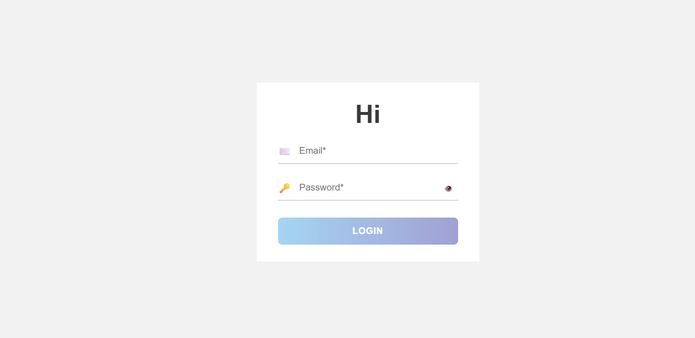
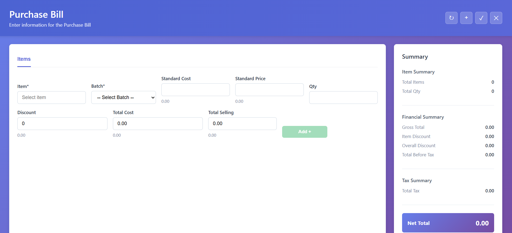

# Enhanzer Purchase Bill Application

A full-stack web application built with **Angular 20** (frontend) and **.NET 7** (backend) for managing purchase bills with item selection, batch management, and real-time calculations.

## 📋 Table of Contents
- [Overview](#overview)
- [Tech Stack](#tech-stack)
- [Prerequisites](#prerequisites)
- [Project Structure](#project-structure)
- [Installation & Setup](#installation--setup)
- [Running the Application](#running-the-application)
- [API Endpoints](#api-endpoints)
- [Features](#features)
- [Screenshots](#screenshots)
- [Troubleshooting](#troubleshooting)

---

## 🎯 Overview

This application consists of **two main pages**:

1. **Login Page** - Authenticates users against an external API and saves their location data to a local SQL database
2. **Purchase Bill Page** - Allows authenticated users to create purchase orders with item selection, batch management, dynamic calculations, and a professional dashboard interface

The application demonstrates:
- JWT-style external API authentication
- SQL Server LocalDB persistence
- Reactive forms with validation
- Real-time data binding and calculations
- RESTful API design
- Modern responsive UI with professional styling

---

## 🛠 Tech Stack

### Backend
- **.NET 7** Web API
- **Entity Framework Core** (Code-First approach)
- **SQL Server LocalDB** for data persistence
- **Swagger/OpenAPI** for API documentation
- **CORS** enabled for cross-origin requests

### Frontend
- **Angular 20** standalone components
- **TypeScript** with strict mode
- **Reactive Forms** for form management
- **HttpClient** for API communication
- **Bootstrap-inspired responsive design**

---

## 📦 Prerequisites

Before you start, ensure you have the following installed:

### Required Software
- **Node.js** (v18.x or later) - [Download](https://nodejs.org/)
- **.NET 7 SDK** - [Download](https://dotnet.microsoft.com/download/dotnet/7.0)
- **SQL Server LocalDB** - [Download](https://learn.microsoft.com/en-us/sql/database-engine/configure-windows/sql-server-express-localdb)
- **Git** - [Download](https://git-scm.com/)
- **Visual Studio Code** or **Visual Studio** (recommended for backend debugging)

### Verify Installation
```bash
# Check Node.js version
node --version
npm --version

# Check .NET version
dotnet --version

# Check SQL Server LocalDB is installed
sqllocaldb info
```

---

## 📂 Project Structure

```
applican/
├── backend/                          # .NET 7 Web API
│   ├── Controllers/
│   │   ├── AuthController.cs        # Login & Auth endpoints
│   │   ├── LocationsController.cs   # Location data endpoints
│   │   └── PurchaseBillsController.cs # Purchase bill endpoints
│   ├── Models/
│   │   ├── LoginRequest.cs
│   │   ├── UserLocation.cs
│   │   ├── ExternalLoginResult.cs
│   │   └── PurchaseBillCreateRequest.cs
│   ├── Services/
│   │   ├── ExternalAuthService.cs   # External API integration
│   │   └── DatabaseService.cs       # SQL operations
│   ├── Program.cs                   # Startup configuration
│   ├── appsettings.json             # Configuration file
│   └── Applican.Api.csproj          # Project file
│
├── frontend/                         # Angular 20 Application
│   ├── src/
│   │   ├── app/
│   │   │   ├── pages/
│   │   │   │   ├── login/           # Login page component
│   │   │   │   └── purchase-bill-add/ # Purchase bill page
│   │   │   ├── services/
│   │   │   │   ├── auth.service.ts
│   │   │   │   └── location.service.ts
│   │   │   ├── guards/
│   │   │   │   └── auth.guard.ts    # Route protection
│   │   │   └── app.routes.ts        # Route configuration
│   │   └── index.html
│   ├── angular.json                 # Angular configuration
│   ├── package.json                 # Dependencies
│   └── tsconfig.json                # TypeScript configuration
│
├── .gitignore                       # Git ignore rules
└── README.md                        # This file
```

---

## 🚀 Installation & Setup

### Step 1: Clone the Repository
```bash
git clone https://github.com/Deathbot545/Enhanzer_Assignment.git
cd applican
```

### Step 2: Set Up Backend (.NET 7)

Navigate to backend directory:
```bash
cd backend
```

Restore NuGet packages:
```bash
dotnet restore
```

Build the backend:
```bash
dotnet build
```

### Step 3: Set Up Frontend (Angular)

Navigate to frontend directory:
```bash
cd ../frontend
```

Install npm dependencies:
```bash
npm install
```

---

## 🏃 Running the Application

### Option 1: Run Both Concurrently

#### Terminal 1 - Start Backend API
```bash
cd C:\applican\backend
dotnet run
```

**Expected Output:**
```
info: Microsoft.Hosting.Lifetime[14]
      Now listening on: https://localhost:5007
```

#### Terminal 2 - Start Frontend Development Server
```bash
cd C:\applican\frontend
npm start
```

**Expected Output:**
```
✔ Compiled successfully.
NOTE: Raw loader CSS support is deprecated. Use raw-loader instead css-loader!

✔ Compiled successfully: App listening on localhost:4200
```

### Access the Application
Open your browser and navigate to:
```
http://localhost:4200
```

---

## 🔐 Login Credentials

Use the following test credentials to log in:

| Field | Value |
|-------|-------|
| **Email** | info@enhanzer.com |
| **Password** | Welcome#3 |

**Note:** These credentials authenticate against an external staging API:
```
https://ez-staging-api.azurewebsites.net/api/External_Api/POS_Api/Invoke
```

Upon successful login, the application will:
1. Create a local SQL database named `ApplicanAssignmentDb`
2. Save all user locations to the `Location_Details` table
3. Redirect to the Purchase Bill page

---

## 🔌 API Endpoints

### Authentication
```
POST /api/auth/login
Content-Type: application/json

Request Body:
{
  "email": "info@enhanzer.com",
  "password": "Welcome#3"
}

Response (200 OK):
[
  {
    "location_Code": "EZCMP1/EZLOC-1",
    "location_Name": "Main Office"
  },
  ...
]

Response (401 Unauthorized):
{
  "message": "Invalid credentials"
}
```

### Get Locations
```
GET /api/locations

Response (200 OK):
[
  {
    "location_Code": "EZCMP1/EZLOC-1",
    "location_Name": "Main Office"
  },
  {
    "location_Code": "EZCMP1/EZLOC-2",
    "location_Name": "Branch Office"
  },
  ...
]
```

### Create Purchase Bill
```
POST /api/purchasebills
Content-Type: application/json

Request Body:
{
  "items": [
    {
      "item": "Mango",
      "batch": "EZCMP1/EZLOC-1",
      "standardCost": 50,
      "standardPrice": 100,
      "quantity": 10,
      "discount": 5
    }
  ]
}

Response (201 Created):
{
  "id": "550e8400-e29b-41d4-a716-446655440000",
  "totalCost": 475,
  "totalSelling": 950
}
```

---

## ✨ Features

### Login Page
✅ Email and password input fields  
✅ Client-side form validation  
✅ Password visibility toggle  
✅ Error message display  
✅ External API authentication  
✅ Automatic database initialization  
✅ Responsive design  

### Purchase Bill Page
✅ **Item Autocomplete** - 7 predefined items (Mango, Apple, Banana, Orange, Grapes, Kiwi, Strawberry)  
✅ **Batch Selection** - Dropdown populated from saved locations  
✅ **Field Inputs** - Standard Cost, Standard Price, Quantity, Discount (%)  
✅ **Real-time Calculations**:
   - Total Cost = (Standard Cost × Quantity) × (1 - Discount/100)
   - Total Selling = Standard Price × Quantity  
✅ **Dynamic Item Table** - Add/Remove items with all calculations  
✅ **Summary Dashboard** - Right sidebar showing:
   - Total Items Count
   - Total Quantity Sum
   - Gross Total (Sales)
   - Total Before Tax (Cost)
   - Tax Summary Placeholder
   - Net Total Highlighted
✅ **Professional UI** - Gradient backgrounds, modern styling, responsive layout  
✅ **Route Protection** - Auth guard prevents unauthorized access  
✅ **Logout Functionality** - Quick logout button in header  

---

## 📸 Screenshots

### 1. Login Page


**Key Elements:**
- Blue gradient header with app title
- Email input field with validation
- Password input with toggle visibility
- Professional styled LOGIN button
- Error message display area
- Responsive card layout

**To Add Screenshot:**
1. Run the application
2. Navigate to http://localhost:4200
3. Take a screenshot (Alt + Print Screen)
4. Save as `login-page.png` in `screenshots` folder

---

### 2. Purchase Bill Add Page


**Key Elements:**
- **Header Section**: Title, action buttons (Refresh, Add, Save, Logout)
- **Form Area**:
  - Item autocomplete field
  - Batch dropdown (populated from DB)
  - Cost/Price/Qty inputs
  - Discount percentage field
  - Real-time calculation display
  - Add Item button
- **Items Table**: Displays all added items with calculations
- **Right Sidebar**:
  - Item Summary (Total Items, Total Qty)
  - Financial Summary (Gross Total, Discounts, Total Before Tax)
  - Tax Summary placeholder
  - Net Total in gradient box

**To Add Screenshot:**
1. Log in with provided credentials
2. Add a few items to the form
3. Take a screenshot of the complete page including the sidebar
4. Save as `purchase-bill-page.png` in `screenshots` folder

---

## 🛠️ Build for Production

### Frontend Production Build
```bash
cd frontend
npm run build
```

**Output:** Angular app compiled to `frontend/dist/frontend/`

### Backend Production Build
```bash
cd backend
dotnet publish -c Release
```

**Output:** .NET app published to `backend/bin/Release/net7.0/publish/`

---

## 🐛 Troubleshooting

### Backend Issues

#### Error: "Address already in use (5007)"
The backend port is already occupied by another process.

**Solution:**
```bash
# Windows PowerShell - Find and kill process on port 5007
$process = Get-NetTCPConnection -LocalPort 5007 -State Listen | Select-Object OwningProcess
Stop-Process -Id $process.OwningProcess -Force

# Then restart backend
dotnet run
```

#### Error: "Cannot connect to database"
SQL Server LocalDB is not running or not installed.

**Solution:**
```bash
# Verify LocalDB is installed and running
sqllocaldb info

# Start LocalDB instance
sqllocaldb start mssqllocaldb
```

#### Error: "External API request failed"
Unable to reach the external authentication API.

**Solution:**
- Check internet connection
- Verify the API endpoint is accessible: `https://ez-staging-api.azurewebsites.net/api/External_Api/POS_Api/Invoke`
- Check backend logs for detailed error message

---

### Frontend Issues

#### Error: "Can't find module 'X'"
Missing npm dependencies.

**Solution:**
```bash
cd frontend
npm install
```

#### Port 4200 already in use
Another application is using the Angular dev server port.

**Solution:**
```bash
# Run on different port
ng serve --port 4300
```

#### CORS error when calling backend
CORS is not properly configured.

**Solution:**
- Verify backend is running on `https://localhost:5007`
- Check `Program.cs` CORS policy includes `http://localhost:4200`
- Restart both frontend and backend

---

### Login Issues

#### Error: "Invalid credentials"
Provided email or password is incorrect.

**Solution:**
- Verify you're using: `info@enhanzer.com` / `Welcome#3`
- Check for extra spaces
- Ensure CAPS LOCK is not on

#### Error: "Database already exists"
Database created on previous login.

**Solution:**
- This is normal behavior
- Application reuses existing database on subsequent logins
- To clear data, delete `ApplicanAssignmentDb` from SQL Server

---

## 📝 Development Notes

### FormBuilder Initialization
Forms use the modern `inject()` pattern for proper initialization:
```typescript
private readonly formBuilder = inject(FormBuilder);
```

### Reactive Forms
All forms implement Angular Reactive Forms with proper validation:
```typescript
form = this.formBuilder.group({
  email: ['', [Validators.required, Validators.email]],
  password: ['', [Validators.required, Validators.minLength(6)]]
});
```

### HTTP Interceptors
API calls are proxied through services for centralized error handling:
```typescript
// auth.service.ts
this.http.post<LocationResponse>('/api/auth/login', request)
```

### Database Connection
LocalDB connection string in `appsettings.json`:
```json
"DefaultConnection": "Server=(localdb)\\mssqllocaldb;Database=ApplicanAssignmentDb;Integrated Security=true;"
```

---

## 📞 Support

For issues or questions:
1. Check the [Troubleshooting](#troubleshooting) section
2. Review backend logs in the terminal
3. Check browser console (F12) for frontend errors
4. Verify all prerequisites are installed

---

## 📄 License

This project is part of the Enhanzer Assignment. All rights reserved.

---

## 🔗 Links

- **Repository**: https://github.com/Deathbot545/Enhanzer_Assignment
- **.NET 7 Documentation**: https://docs.microsoft.com/en-us/dotnet/core/whats-new/dotnet-7
- **Angular 20 Documentation**: https://angular.io/docs
- **SQL Server LocalDB**: https://learn.microsoft.com/en-us/sql/database-engine/configure-windows/sql-server-express-localdb

---

**Last Updated**: March 19, 2026  
**Version**: 1.0.0
